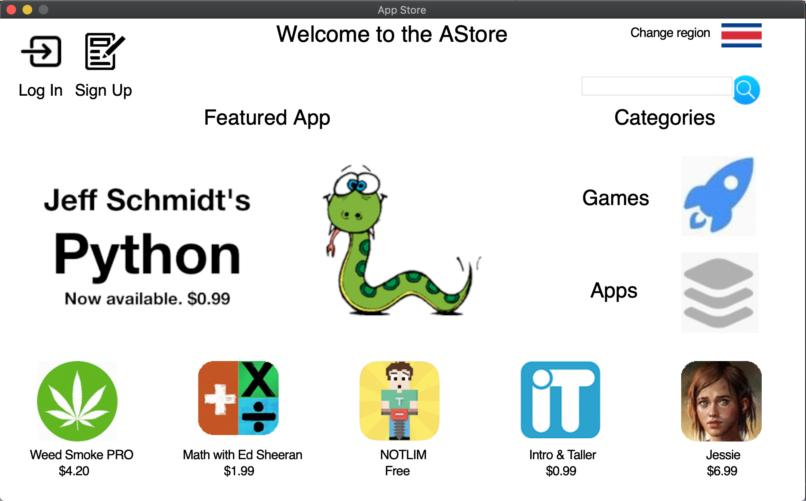
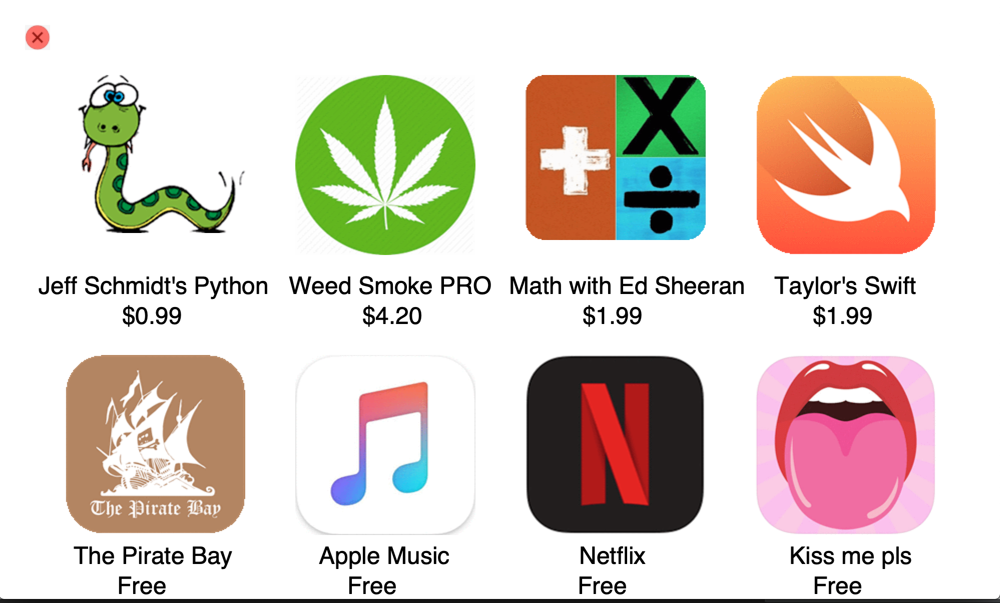
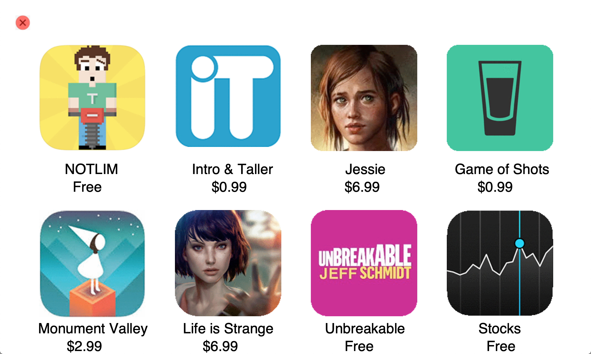
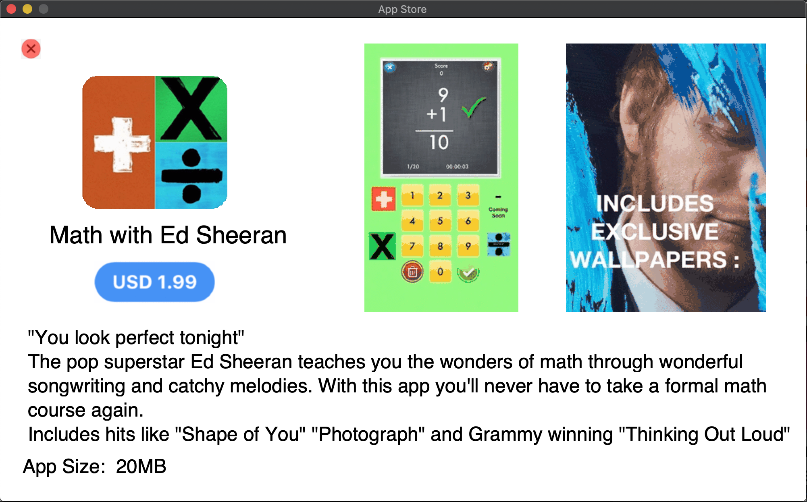
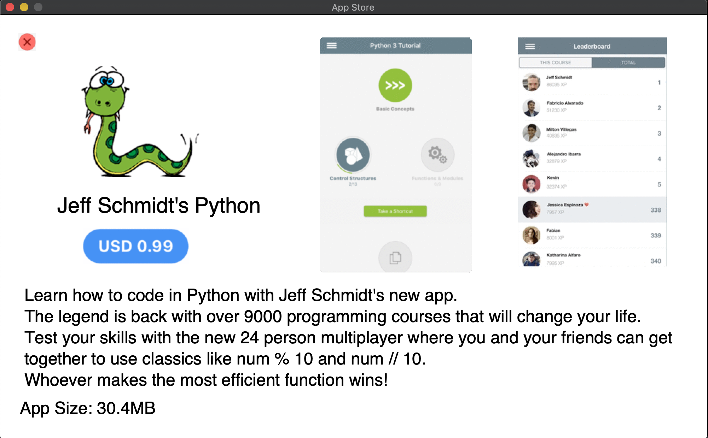
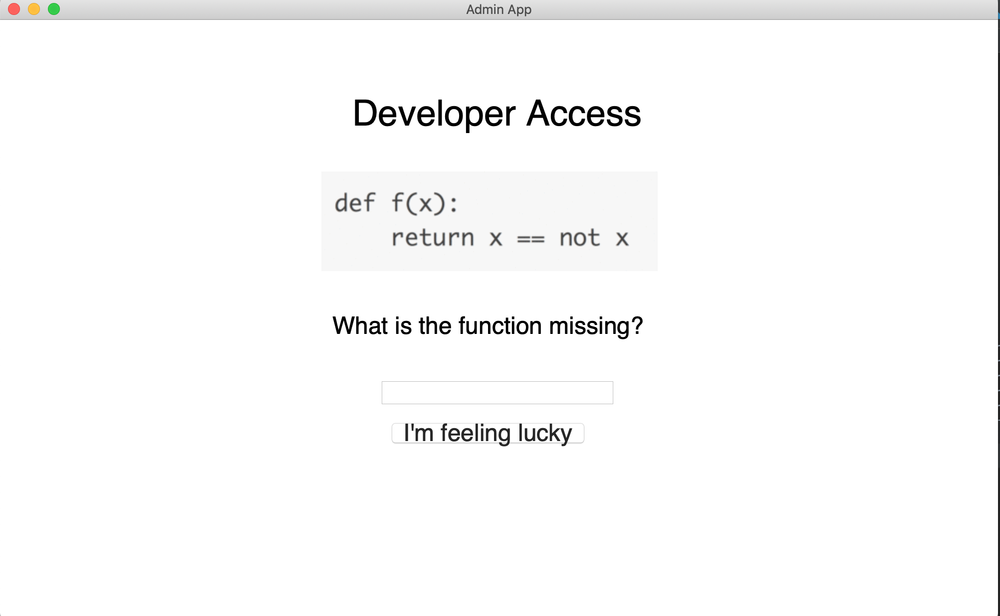
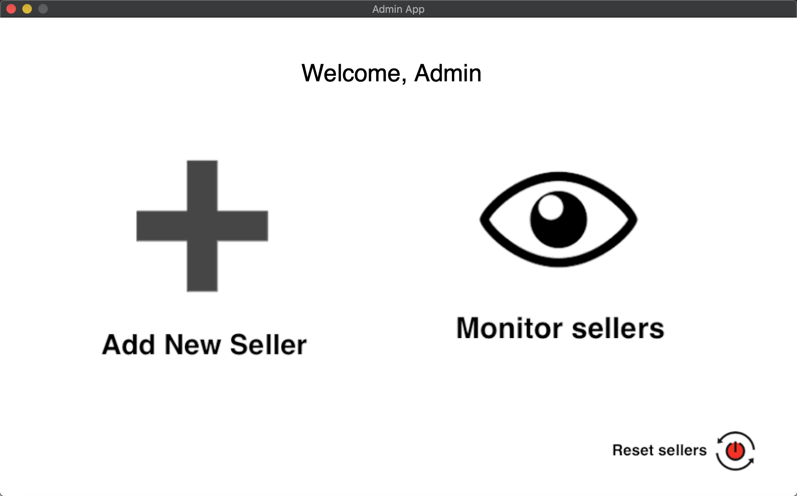
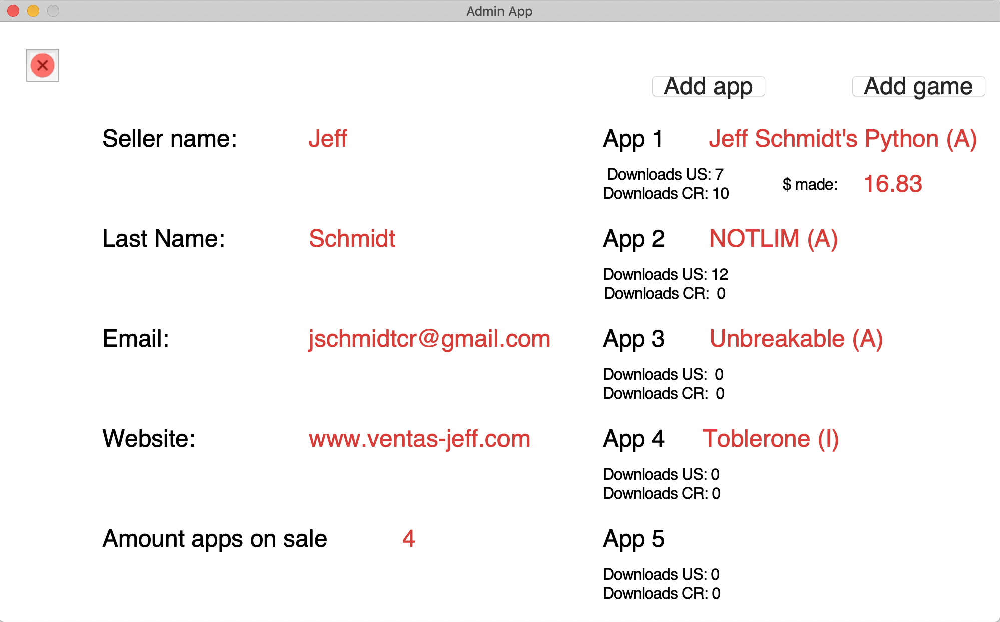
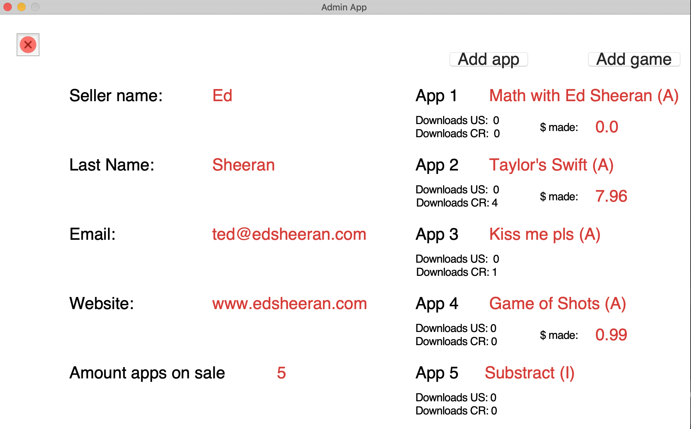

# AStore
CE-1102. First programming project. #Jeff

## Random comment
  Oh, hi there. This was the very first full fledged (well, kind of) project of my first college programming course.
  
  It was made back all the way back in 2018, and I didn't know basically anything about coding. 
  The objective was to create an app store mockup. 
  It wasn't supposed to actually work with servers and stuff, so the most important aspect of it was how it looked. 
  Luckily, I knew a thing or two about Photoshop, so I probably spent about 90% of the time editing pictures and perfecting the details, and the rest in an battle of epic proportions against the Python compiler.
  For some reason, my teacher wanted it to be under 2MB, so every bit of space mattered. And I couldn't use classes or iteration, so everything had to be done with recursion in one file. That's why it looks so weird in code.
  
  The project has a main client app, along with an admin console to manage the store's sellers and data. 
  It also featured a register/login system, and dual language support. (English & Spanish) There were probably other smaller things, but I forgot. It's been a while, okay...
  
  I decided to upload this to have a copy of it floating around somewhere in the internet. 
  Not the best work, but it's always fun to look back at when you were just getting started to compare it with how far you've come since then.
  
  So yeah, it was fun to make, and it has a whole bunch of easter eggs scattered around its guts.
  No one'll ever notice, but oh well... Deep down I know they're there. 
  It's kind of like when you know that there's something special going on with someone. 
  Just, less stressful and without the likely heartbreak.

## Pictures

Main Menu                  |
:-------------------------:|
|

App Menu                        |Game Menu                      |
:------------------------------:|:------------------------------:
  |  

App Example                |Game Example              |
:-------------------------:|:-------------------------:
  |  

Admin Login                 |Admin Menu               |
:-------------------------:|:-------------------------:
  |  

Sellers                    |                          | 
:-------------------------:|:-------------------------:
  |  

## Prerequisites

Default Python. Originally made in version 3.6.4 with macOS High Sierra 10.13.4 but tested in May 2019 for version 3.7.3 with macOS Mojave 10.14.6 and everything worked fine.

## Authors

* **Alejandro Ibarra** - *Developer* - [AlejandroIbarraC](https://github.com/AlejandroIbarraC)

## Acknowledgments

* **Mr. Jeff Schmidt** - *Teacher* 

## License

This project is licensed under the GNU License - see the [LICENSE.md](LICENSE.md) file for details
